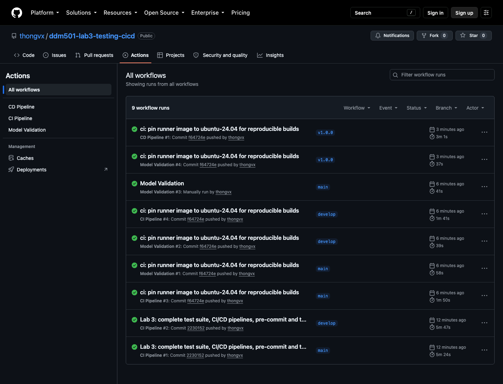
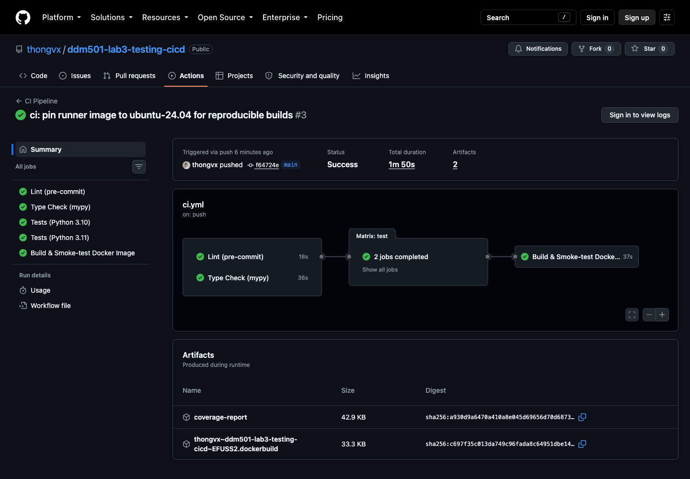
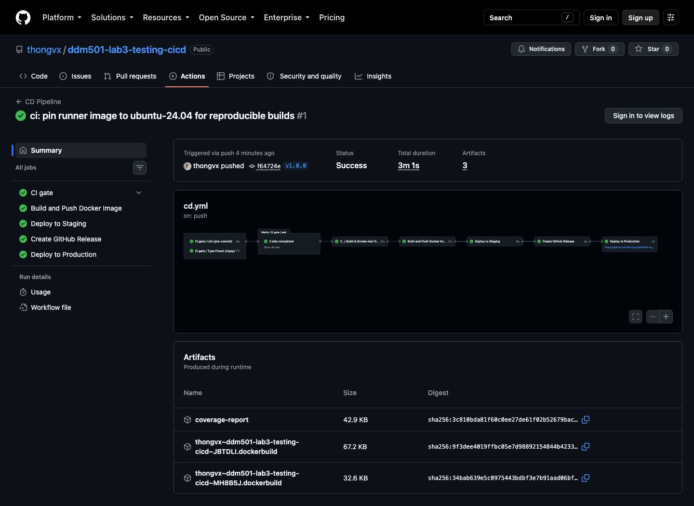
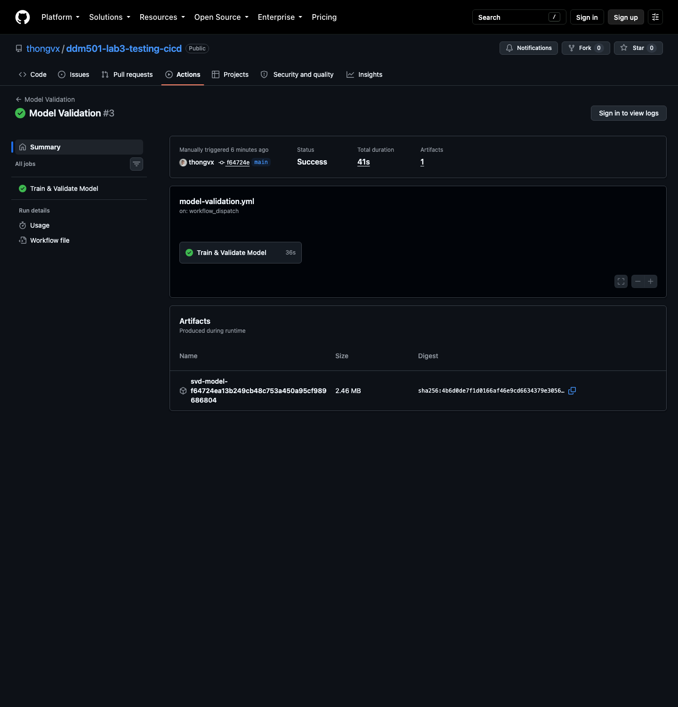
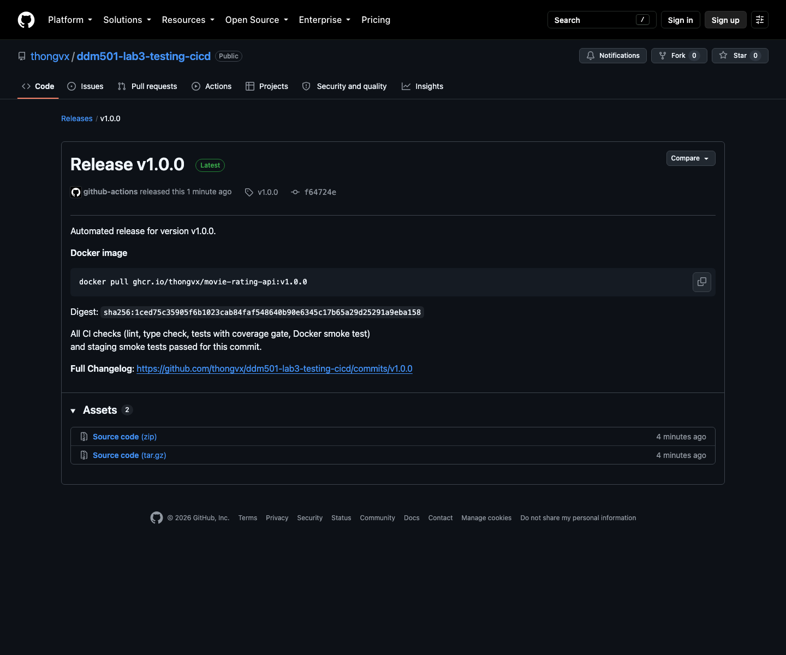
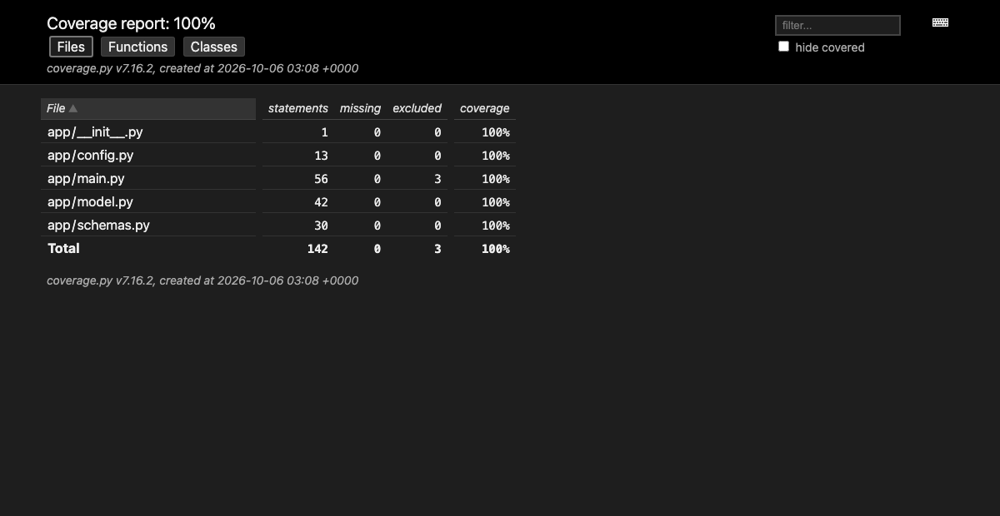
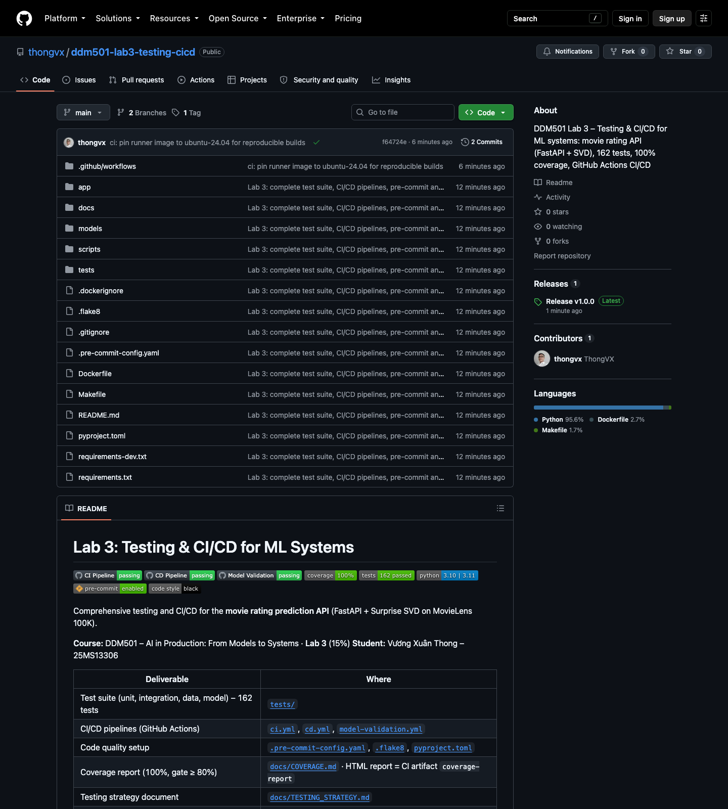

# Lab 3: Testing & CI/CD for ML Systems

[](https://github.com/thongvx/ddm501-lab3-testing-cicd/actions/workflows/ci.yml)
[](https://github.com/thongvx/ddm501-lab3-testing-cicd/actions/workflows/cd.yml)
[](https://github.com/thongvx/ddm501-lab3-testing-cicd/actions/workflows/model-validation.yml)


[](.pre-commit-config.yaml)
[](https://github.com/psf/black)

Comprehensive testing and CI/CD for the **movie rating prediction API** (FastAPI + Surprise SVD on
MovieLens 100K).

**Course:** DDM501 – AI in Production: From Models to Systems · **Lab 3** (15%)
**Student:** Vương Xuân Thong – 25MS13306

| Deliverable | Where |
|---|---|
| Test suite (unit, integration, data, model) – 162 tests | [`tests/`](tests) |
| CI/CD pipelines (GitHub Actions) | [`ci.yml`](.github/workflows/ci.yml), [`cd.yml`](.github/workflows/cd.yml), [`model-validation.yml`](.github/workflows/model-validation.yml) |
| Code quality setup | [`.pre-commit-config.yaml`](.pre-commit-config.yaml), [`.flake8`](.flake8), [`pyproject.toml`](pyproject.toml) |
| Coverage report (100%, gate ≥ 80%) | [`docs/COVERAGE.md`](docs/COVERAGE.md) · HTML report = CI artifact `coverage-report` |
| Testing strategy document | [`docs/TESTING_STRATEGY.md`](docs/TESTING_STRATEGY.md) |
| Screenshots of passing workflows | [`docs/screenshots/`](docs/screenshots) |
| Submission PDF (rubric checklist + screenshots + strategy) | [`DDM501_Lab3_25MS13306_VuongXuanThong.pdf`](DDM501_Lab3_25MS13306_VuongXuanThong.pdf) |

## Project structure

```
ddm501-lab3-testing-cicd/
├── app/
│   ├── main.py             # FastAPI app (lifespan model loading, 503/500 handling)
│   ├── model.py            # MovieRatingModel wrapper (predict, predict_batch, clipping)
│   ├── schemas.py          # Pydantic v2 request/response schemas
│   └── config.py           # Settings (env-var overridable)
├── scripts/
│   ├── train_model.py      # MovieLens 100K → SVD (seed 42) + hold-out metrics
│   └── validate_model.py   # Model quality gate (RMSE ≤ 0.95, MAE ≤ 0.75)
├── tests/
│   ├── conftest.py         # Shared fixtures (lifespan TestClient, model, real dataset)
│   ├── unit/               # 63 tests: model wrapper (incl. stub model), schemas, config
│   ├── integration/        # 44 tests: every endpoint, validation, 404/405/422/500/503, latency
│   ├── data/               # 32 tests: sample data + MovieLens 100K data contract
│   └── model/              # 23 tests: invariance, directional, MFT, performance, robustness
├── docs/                   # testing strategy, coverage report, CI screenshots
├── .github/workflows/      # ci.yml, cd.yml, model-validation.yml
├── .pre-commit-config.yaml # black, isort, flake8, mypy, hygiene, pytest
├── Dockerfile              # multi-stage: build wheels → train → slim runtime (non-root)
├── Makefile                # shortcuts (make test, make lint, ...)
└── pyproject.toml          # black / isort / mypy / pytest / coverage config
```

## Quick start

```bash
git clone https://github.com/thongvx/ddm501-lab3-testing-cicd.git
cd ddm501-lab3-testing-cicd
python3.10 -m venv venv && source venv/bin/activate
pip install -r requirements.txt -r requirements-dev.txt
pre-commit install                     # git hooks

python scripts/train_model.py          # downloads MovieLens 100K, trains, writes models/
python scripts/validate_model.py       # model quality gate

pytest tests/ --cov=app --cov-report=term-missing --cov-report=html   # 162 tests, 100%
uvicorn app.main:app --reload --port 8000                             # http://localhost:8000/docs
```

Docker:

```bash
docker build -t movie-rating-api .     # trains the model inside the build (reproducible, seed 42)
docker run -p 8000:8000 movie-rating-api
curl -X POST localhost:8000/predict -H 'Content-Type: application/json' -d '{"user_id":"196","movie_id":"242"}'
```

## Testing

| Layer | Tests | Highlights |
|---|---:|---|
| Unit | 63 | stub model pickled to `tmp_path` tests clipping/rounding/error branches without training |
| Integration | 44 | `TestClient` inside `with` so the lifespan loads the model; 503 & 500 paths; no internal error leakage |
| Data | 32 | hand-made fixture **and** the real 100K ratings (943 users, 1 682 movies, no duplicates, ≥ 20 ratings/user) |
| Model behaviour | 23 | CheckList: invariance, directional (5★ > 1★ for ≥ 95% of users, cold-start follows popularity), MFT, hold-out thresholds, baseline comparison |

Details and rationale: **[docs/TESTING_STRATEGY.md](docs/TESTING_STRATEGY.md)**.

```bash
pytest tests/unit/ -v          # or tests/integration, tests/data, tests/model
pytest -m integration          # by marker
make test                      # full suite with the 80% coverage gate
```

## CI/CD

| Workflow | Trigger | Jobs |
|---|---|---|
| **CI Pipeline** | push to `main`/`develop`, PR to `main`, manual, reused by CD | Lint (pre-commit) · Type check (mypy) → Tests on Python 3.10 & 3.11 (train, model gate, 162 tests, coverage ≥ 80%, HTML report artifact) → Docker build + smoke test + HEALTHCHECK |
| **CD Pipeline** | tag `v*` | CI gate → build & push image to GHCR (`ghcr.io/thongvx/movie-rating-api`, optional Docker Hub) → staging deploy + smoke tests → GitHub Release → production (environment) |
| **Model Validation** | change in `models/`, `scripts/`, `app/model.py`, `requirements.txt`; weekly; manual | 5-fold CV + hold-out → RMSE ≤ 0.95, MAE ≤ 0.75 → model artifact |

Release a new version:

```bash
git tag -a v1.0.1 -m "v1.0.1" && git push origin v1.0.1
docker pull ghcr.io/thongvx/movie-rating-api:1.0.1
```

Rollback = redeploy the previous immutable tag (`vX.Y.Z` / `sha-<commit>`).

## Screenshots of passing workflows

| | |
|---|---|
| **All workflows green** (CI on `main` + `develop`, Model Validation, CD on tag `v1.0.0`) |  |
| **CI Pipeline**: lint → type check → tests (3.10, 3.11) → Docker smoke test |  |
| **CD Pipeline**: CI gate → build & push (GHCR) → staging → release → production |  |
| **Model Validation**: train + RMSE/MAE gate |  |
| **GitHub Release v1.0.0** created by CD |  |
| **Coverage report** (HTML, artifact `coverage-report`) |  |
| **Repository with passing badges** |  |

## Code quality

* **pre-commit** (`pre-commit run --all-files`): trailing whitespace, EOF, YAML/JSON/TOML, large files,
  merge conflicts, private keys, debug statements, **black**, **isort**, **flake8**, **mypy**, and a local
  **pytest** hook for unit tests (skipped in CI because the test job runs the full suite).
* **Type hints** everywhere in `app/` and `scripts/` (`mypy --disallow-untyped-defs`: 0 errors).
* Line length 100 (black, isort, flake8 aligned).

## Changes made to the starter (and why)

| Change | Reason |
|---|---|
| `scikit-surprise` 1.1.3 → **1.1.4** | 1.1.3 has no PEP 517 metadata and fails to build with pip ≥ 23.1 (which CI installs) |
| `Dataset.load_builtin(..., prompt=False)` | the default asks *"download? [Y/n]"* and hangs/fails in CI and Docker |
| `SVD(random_state=42)` + hold-out `metrics.json` | reproducible model; real accuracy measured on unseen ratings |
| `on_event("startup")` → **lifespan** | `on_event` is deprecated; tests now load the model through the same path as production |
| `conftest.test_client` uses `with TestClient(app)` | a bare `TestClient(app)` never ran startup → every prediction returned 503 |
| 500 errors return a generic message | the starter returned `str(e)`, leaking internals to clients |
| `predict()` rejects non-string IDs | `None` silently became a cold-start prediction |
| Multi-stage Dockerfile, Python HEALTHCHECK, non-root user | slim image had no compiler for Surprise and no `curl` for the health check |
| CD pushes to **GHCR** with `GITHUB_TOKEN` | works without secrets; Docker Hub push is enabled automatically if `DOCKER_USERNAME/PASSWORD` exist |

## License

MIT License – for educational purposes only.
